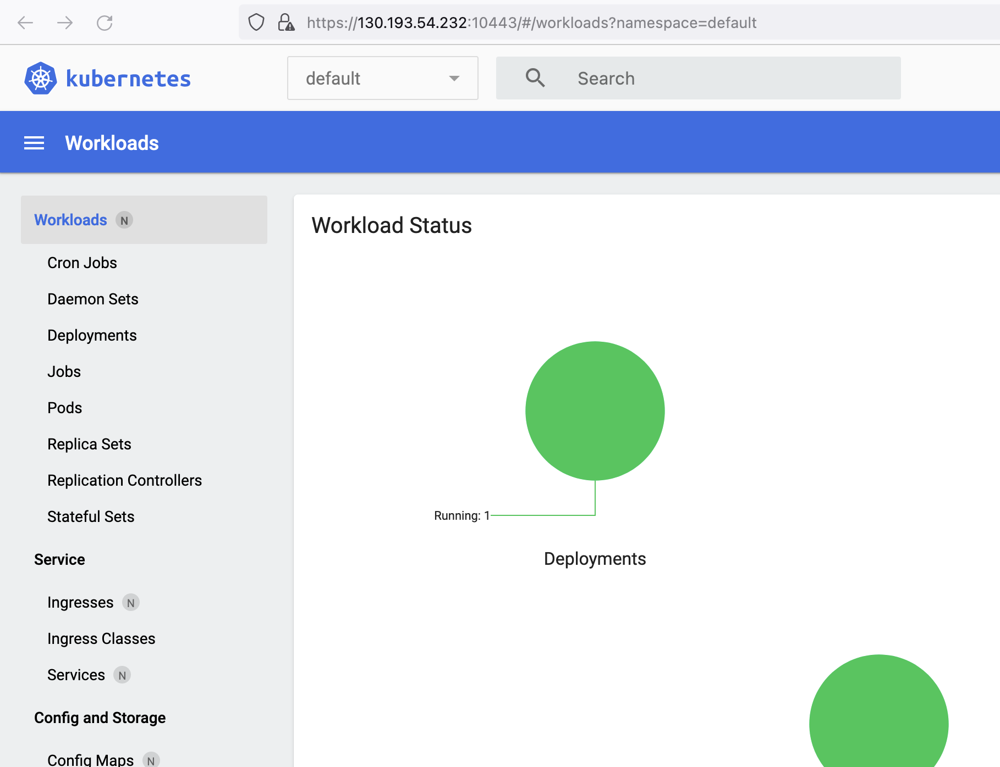

# Домашнее задание к занятию «Kubernetes. Причины появления. Команда kubectl»

### Цель задания

Для экспериментов и валидации ваших решений вам нужно подготовить тестовую среду для работы с Kubernetes. Оптимальное решение — развернуть на рабочей машине или на отдельной виртуальной машине MicroK8S.

------

### Задание 1. Установка MicroK8S

1. Установить MicroK8S на локальную машину или на удалённую виртуальную машину.
```
yura@ubuntu-test:~$ microk8s status
microk8s is running
high-availability: no
  datastore master nodes: 127.0.0.1:19001
  datastore standby nodes: none
addons:
  enabled:
    dashboard            # (core) The Kubernetes dashboard
    dns                  # (core) CoreDNS
    ha-cluster           # (core) Configure high availability on the current node
    helm                 # (core) Helm - the package manager for Kubernetes
    helm3                # (core) Helm 3 - the package manager for Kubernetes
    hostpath-storage     # (core) Storage class; allocates storage from host directory
    metrics-server       # (core) K8s Metrics Server for API access to service metrics
    storage              # (core) Alias to hostpath-storage add-on, deprecated
```
2. Установить dashboard.
```
microk8s enable dashboard
```
3. Сгенерировать сертификат для подключения к внешнему ip-адресу.
```
yura@ubuntu-test:~$ sudo vim /var/snap/microk8s/current/certs/csr.conf.template
...
Добавил строку:
IP.3 = 130.193.54.232
...
Обновил сертификат:
yura@ubuntu-test:~$ sudo microk8s refresh-certs --cert front-proxy-client.crt
```
------

### Задание 2. Установка и настройка локального kubectl
1. Установить на локальную машину kubectl.
2. Настроить локально подключение к кластеру.
```
Получил данные кластера microk8s на удаленной машине:
yura@ubuntu-test:~$ sudo microk8s config
...
Потом внес параметры cluster, user и context на локальной машине
yura@Skynet ~ % sudo vim .kube/config
yura@Skynet ~ % kubectl config get-contexts
CURRENT   NAME             CLUSTER            AUTHINFO         NAMESPACE
*         docker-desktop   docker-desktop     docker-desktop
          microk8s         microk8s-cluster   admin
yura@Skynet ~ % kubectl config use-context microk8s
Switched to context "microk8s".
yura@Skynet ~ % kubectl get nodes
NAME          STATUS   ROLES    AGE   VERSION
ubuntu-test   Ready    <none>   75m   v1.28.1
```
3. Подключиться к дашборду с помощью port-forward.
```
yura@ubuntu-test:~$ kubectl port-forward -n kube-system service/kubernetes-dashboard 10443:443 --address 0.0.0.0
```
<p align="center">
  
</p>